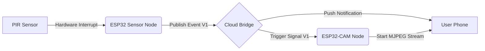

# 🛡️ Sentinel: Distributed IoT Security System

> A decoupled, two-node security ecosystem operating on an Event-Driven Architecture.

## 📡 System Architecture
This project moves beyond simple loop-based microcontrollers by implementing a **Distributed IoT Network**. It consists of two independent nodes communicating via a cloud bridge (Blynk), minimizing latency and power consumption.

* **Node A (The Sentry):** A low-power sensor unit that sleeps until an interrupt is triggered.
* **Node B (The Eye):** A camera unit that acts as a subscriber, waiting for wake-up signals to begin streaming.

### The Logic Flow (Pub/Sub Pattern)
The system uses **Virtual Pins** to create a logic bridge over Wi-Fi.

💻 Key Technical Features
1. Event-Driven Communication

Instead of constantly polling the sensor (which wastes cycles), the Sensor Node utilizes Interrupt Service Routines (ISRs).

Idle State: The Camera Node remains in a low-bandwidth "listening" mode.

Active State: When the PIR triggers, the Sensor Node "publishes" a logic HIGH to the cloud. The Camera Node "subscribes" to this change and immediately triggers the video pipeline.

2. "Virtual Wire" Bridging

The communication bridge is abstracted via the Blynk Protocol, allowing the two devices to act as if they are physically wired together, despite being on different parts of the network.

3. Remote Telemetry

Live Stream: MJPEG video feed delivered to the local network via web server.

Push Notifications: Instant mobile alerts upon intrusion detection.

Evidence Capture: Automates a static "mugshot" saved to the SD card upon trigger.

### 🔌 Hardware Required

| Component | Role | Notes |
| :--- | :--- | :--- |
| **ESP32 (Dev Module)** | Sensor Node | Handles logic & cloud publishing. |
| **ESP32-CAM (AI-Thinker)** | Camera Node | Handles video streaming & SD storage. |
| **PIR Sensor (HC-SR501)** | Input | Triggers the hardware interrupt. |
| **Passive Buzzer** | Output | Provides a local audible alarm. |
| **FTDI Programmer** | Tool | Required to flash the ESP32-CAM (since it lacks USB). |

📂 Installation & Setup
1. Clone the Repository

Bash
git clone [https://github.com/maxi-cmyk/sentinel-iot.git](https://github.com/maxi-cmyk/sentinel-iot.git)

2. Configure Credentials

Navigate to include/ and rename auth_template.h to auth_tokens.h. Update it with your personal credentials:

#define WIFI_SSID "Your_WiFi_Name"
#define WIFI_PASS "Your_WiFi_Password"
#define BLYNK_AUTH_SENSOR "Your_Sensor_Token"
#define BLYNK_AUTH_CAMERA "Your_Camera_Token"

3. Flash the Nodes

Sensor Node: Open Sensor_Node/Sensor_Node.ino and upload to the standard ESP32.

Camera Node: Open Camera_Node/Camera_Node.ino.

Connect GPIO 0 to GND.

Plug in your FTDI programmer.

Upload the code.

Important: Remove the jumper wire after uploading to run the code.
